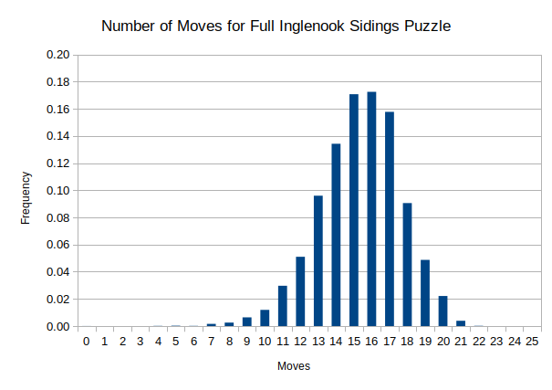

## i-s-test.

## Prolog predicates for the Inglenook Sidings Puzzle that are used to find solutions for all standard starting conditions.

### (See the folder "inglenook-sidings" for Prolog programs that generate random starting conditions and their solutions.)

### Results

- There are 8! = 40320 standard starting conditions for the full version of the puzzle. The solutions were calculated 1000 at a time using yap.  Yap (Yet Another Prolog) was used because it is faster than SWI Prolog and gprolog.  The number of moves needed for each start are shown in the spreadsheet full-solutions.ods.  The individual solution steps were not kept.

- For the small version, predicates generated all standard starting conditions in one run as there are only 5! = 120.  The number of moves needed are shown in small-solutions.ods.  The individual solution steps for all starts are in the text file small-solutions.txt.

### Solution Method

- For the small version the search method known as "iterative deepening depth first" (IDDF) was used.  As applied here, this method will find a solution with a minimal number of moves.

- For the large version the IDDF search method had to be modified to avoid excessively long run times.  The modification first breaks the solution into two parts.  The first part uses IDDF to find a solution from the starting condition to an intermediate condition where Track 2 contains just the three cars on the bumper end of that track in the same order as in the end condition.  The second part then uses IDDF to find a solution from this intermediate condition to the end condition.  This gives a "forward" solution.  The same two-part process is then done again but with the start and end conditions interchanged.  This gives a "backward" solution.  The final solution chosen is whichever of these two is shorter (or the forward solution if they are of equal length).  If the backward solution is chosen, its steps are taken in reverse order, of course.

### Comments on Results

- In his excellent paper "Inglenook Shunting Puzzles," Simon Blackburn states that for all starting conditions only 20 moves or less are needed for optimal solutions (where no intermediate node is used) of the full-sized puzzle.  Early investigations made before the complete results above were generated suggest that the approach used here adds on average about one to two additional moves to a solution above the optimal value.  A histogram of the results found here seems consistent with this hunch:

  

- Of the 40320 starting conditions, only 156 (less than 0.4%) required 21 moves for a solution and only 7 required 22 moves.  No solutions required more than 22 moves.

- I believe these results support Simon's comment that the heuristic of "working from the back wagons forward [from the bumper end of the siding]" is reasonably efficient.  Even though we have modified this heuristic by calculating both "forward" and "backward" solutions and chosing the better of these, earlier studies using random samples of the starting conditions showed that using only the "forward" solution would add on average only one step to a solution.
